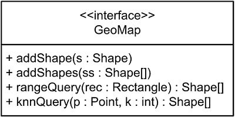

# Software Studio Assignment 2 - GeoMap

Leveraging the spatial framework learned so far, write a small map program.

## Requirements

Please write a class `GeoMapImpl` that implements `GeoMap` interface in package `netdb.courses.softwarestudio.geomap.map`.

Note: You **can not** modify the `GeoMap` interface - `GeoMap.java`.

## Hints

You may want to add the following abilities into the **spatial** package:

- Check whether two spatial objects intersect.
- Get the distance between two spatial objects.

## Testing

Uncomment the line 48 to 50 of `netdb.courses.softwarestudio.geomap.Tester` under `src/test/java` and run the test cases to verify your work.

## Submission

The procedure of submission is as following:

1. Fork our [template repository][1] on GitLab.
2. Change the **"Visibility Level"** of the forked repository to **private**.
3. Clone the repository you forked.
4. Finish your work, run test cases to check if your implementation meets the requirements.
5. Commit your work, push to GitLab and then open a merge request to submit.

Note:

- Don't forget to add files to index before commit.
- To submit a newer version after opening a merge request, simply push again.**you don't need to resend merge request**
- If you can't push, please double check the repository that you just cloned(You should clone **your repo ex: Katy/Assignment 2 - GeoMap instead of TA's repository 2016 Software Studio / Assignment 2 - GeoMap**)
- please practice how to `git clone` `git add .` `git push` to submit your homework **in terminal**

Please refer to the lab slides: [Version Control & Debugger][2] for a complete tutorial on how to fork, clone and summit merge request.

## Deadline

Sumbit your work before the deadline as announced in class

Late submissions **WILL NOT** be accepted.

[1]: http://shwu10.cs.nthu.edu.tw/2016-software-studio/assignment2-geomap
[2]: http://shwu10.cs.nthu.edu.tw/2016-software-studio/release-slides/raw/master/03_Lab_VCS_Debugger-copy-2.pdf
